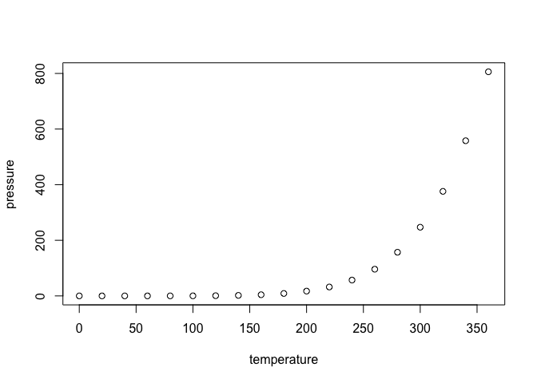

p8105\_hw2\_dk2759
================
Darwin Keung
10/4/2018

``` r
library(tidyverse)
```

    ## ── Attaching packages ────────────────────────────────────────── tidyverse 1.2.1 ──

    ## ✔ ggplot2 3.0.0     ✔ purrr   0.2.5
    ## ✔ tibble  1.4.2     ✔ dplyr   0.7.6
    ## ✔ tidyr   0.8.1     ✔ stringr 1.3.1
    ## ✔ readr   1.1.1     ✔ forcats 0.3.0

    ## ── Conflicts ───────────────────────────────────────────── tidyverse_conflicts() ──
    ## ✖ dplyr::filter() masks stats::filter()
    ## ✖ dplyr::lag()    masks stats::lag()

``` r
## Reading and cleaning the data NYC Subway Entrance and Exit Data
NYC_Subway_Data = read_csv(file = "./Data/NYC_Transit_Subway_Entrance_And_Exit_Data.csv")
```

    ## Parsed with column specification:
    ## cols(
    ##   .default = col_character(),
    ##   `Station Latitude` = col_double(),
    ##   `Station Longitude` = col_double(),
    ##   Route8 = col_integer(),
    ##   Route9 = col_integer(),
    ##   Route10 = col_integer(),
    ##   Route11 = col_integer(),
    ##   ADA = col_logical(),
    ##   `Free Crossover` = col_logical(),
    ##   `Entrance Latitude` = col_double(),
    ##   `Entrance Longitude` = col_double()
    ## )

    ## See spec(...) for full column specifications.

``` r
names(NYC_Subway_Data)
```

    ##  [1] "Division"           "Line"               "Station Name"      
    ##  [4] "Station Latitude"   "Station Longitude"  "Route1"            
    ##  [7] "Route2"             "Route3"             "Route4"            
    ## [10] "Route5"             "Route6"             "Route7"            
    ## [13] "Route8"             "Route9"             "Route10"           
    ## [16] "Route11"            "Entrance Type"      "Entry"             
    ## [19] "Exit Only"          "Vending"            "Staffing"          
    ## [22] "Staff Hours"        "ADA"                "ADA Notes"         
    ## [25] "Free Crossover"     "North South Street" "East West Street"  
    ## [28] "Corner"             "Entrance Latitude"  "Entrance Longitude"
    ## [31] "Station Location"   "Entrance Location"

## R Markdown

This is an R Markdown document. Markdown is a simple formatting syntax
for authoring HTML, PDF, and MS Word documents. For more details on
using R Markdown see <http://rmarkdown.rstudio.com>.

When you click the **Knit** button a document will be generated that
includes both content as well as the output of any embedded R code
chunks within the document. You can embed an R code chunk like this:

``` r
summary(cars)
```

    ##      speed           dist       
    ##  Min.   : 4.0   Min.   :  2.00  
    ##  1st Qu.:12.0   1st Qu.: 26.00  
    ##  Median :15.0   Median : 36.00  
    ##  Mean   :15.4   Mean   : 42.98  
    ##  3rd Qu.:19.0   3rd Qu.: 56.00  
    ##  Max.   :25.0   Max.   :120.00

## Including Plots

You can also embed plots, for example:

<!-- -->

Note that the `echo = FALSE` parameter was added to the code chunk to
prevent printing of the R code that generated the plot.
